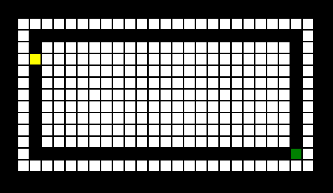

<div align = "center">

<h1><a href="https://2kabhishek.github.io/balance-beam">Balance Beam</a></h1>

<a href="https://github.com/2KAbhishek/balance-beam/blob/main/LICENSE">
 </a>

<a href="https://github.com/2KAbhishek/balance-beam/pulse">
 </a>

<a href="https://github.com/2KAbhishek/balance-beam/stargazers">
</a>

<a href="https://github.com/2KAbhishek/balance-beam/network/members">
 </a>

<a href="https://github.com/2KAbhishek/balance-beam/watchers">
 </a>

<a href="https://github.com/2KAbhishek/balance-beam/graphs/contributors">
 </a>

<a href="https://github.com/2KAbhishek?tab=followers">
 </a>

<h3>Balance the turtle on a beam 🐢🕹️</h3>

<figure>
  
  <br/>
  <figcaption>balance-beam screenshot</figcaption>
</figure>

</div>

## What is this

Balance Beam is a game where you guide a turtle to it's destination.

## Inspiration

Wanted to try out `turtle` module

## Prerequisites

Before you begin, ensure you have met the following requirements:

- You have installed the latest version of `python`, `turtle`

## Getting balance-beam

To install balance-beam, follow these steps:

```bash
git clone https://github.com/2kabhishek/balance-beam
cd balance-beam
python balance_beam.py # Runs the game
```

## Using balance-beam

Running the game asks some questions on the terminal and opens a new window.
You can use the up, down, left and right arrow keys to move the turtle.

## How it was built

balance-beam was built using `python` and `turtle`

## What I learned

- Learned about `turtle` and how to use it

## What's next

Use `turtle` for other games.

Hit the ⭐ button if you found this useful.

## More Info

<div align="center">

<a href="https://github.com/2KAbhishek/balance-beam">Source</a> | <a href="https://2kabhishek.github.io/balance-beam">Website</a>

</div>
